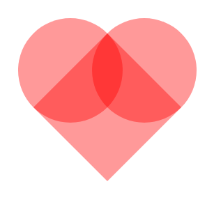

<h1 align='center'>Creating a heart with only CSS3.</h1>

In this example, I will teach you how to create a simple heart, just with CSS3.

- First I create the HTML structure:
```html
<!DOCTYPE html>
<html lang="en">
<head>
    <meta charset="UTF-8">
    <meta name="viewport" content="width=device-width, initial-scale=1.0">
    <title>Creating a heart with only CSS3.</title>
    <link rel="stylesheet" href="css/style.css">
</head>
<body>
    <div id="heart"></div>
</body>
</html>
```

- Then I create the CSS reset and centralize the page content with Flex-box:
```css
* {
    padding: 0;
    margin: 0;
    box-sizing: border-box;
}

body, html {
    height: 100vh;

    display: flex;
    justify-content: center;
    align-items: center;
}
```

- Now I create a square (measuring 150px) and define a background color. I also set its 'position' property to the value 'relative':
```css
#heart {
    position: relative;

    width: 150px;
    height: 150px;

    background-color: rgba(255,0,0,.4);
}
```

Rendering:


- In this step, I define the pseudo-elements, their measurements, background and positioning.

```css
#heart::before, #heart::after {
    content: '';

    position: absolute;

    width: inherit;
    height: inherit;

    background-color: rgba(255,0,0,.4);
}

#heart::before {
    left: -50%;
}

#heart::after {
    top: -50%;
}
```

Rendering:


- Now, I just rotate the element, adding the transform rotate property::
```css
#heart {
    ...
    transform: rotate(45deg);
}
```

Rendering:


- After that, I leave the pseudo-elements circular, adding the property 'border-radius', value '50%':
```css
#heart::before, #heart::after {
    ...
    border-radius: 50%;
}
```

Rendering:



- Finally, to make the whole set a uniform color, I simply set ALL BACKGROUNDS to the value '#f99':

```css
background-color: rgba(255,0,0,.4);
```

Rendering:


Ready! Our heart is done, only with CSS3. If you liked it, leave your star in the repository.
